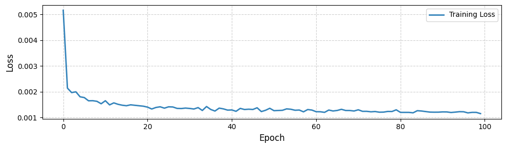
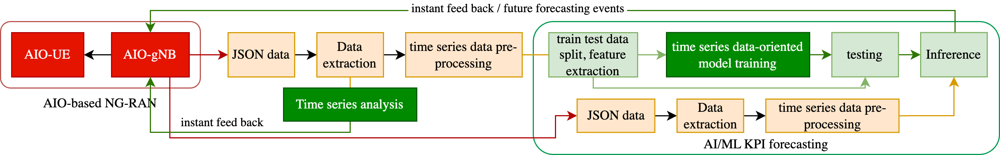

# AI-Open-RAN for Non-Terrestrial Networks (AIO-RAN-NTN)

## AIO-RAN: Key Elements of Open-RAN and AI-RAN

## Proposed AIO-RAN-NTN Blueprint

## Testbed

**Transmitter:** gNB with OAIBOX  

**Device Setup**  
  

**Receiver:** Quectel 5G module with SIM card  

  

**UE Configuration and Connectivity**  

  

**Operation**  
  

**DL/UL Rates**  

**KPI Performance**  
  
  

**Observations**  

  

## Model Training and Inference

**Dataset**  

**Training and Testing**  
  

**Proposed KPI Prediction Pipeline**  

